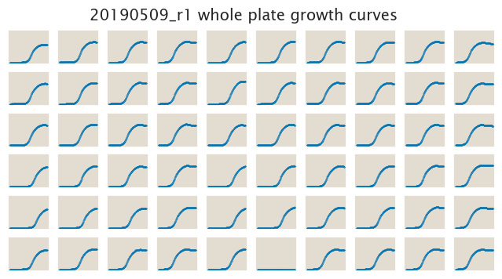
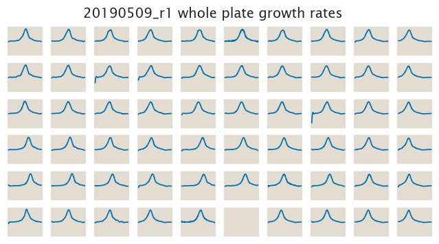

# 2019-05-09 Plate Reader Growth Measurement

## Purpose
This experiment aims to measure the growth rate of the *E. coli* strains of
interest in M9 minimal media with and without 5 µg/mL chloramphenicol selection.
The experiment was done with different combination of dilutions in order to test what are the best conditions for the rest of the experiments

## Strain Information

| Plasmid | Genotype | Host Strain | Shorthand |
| :------ | :------- | ----------: | --------: |
| `pZS4*5-mCherry`| `galK<>25O1+11-sacB-cmR-YFP` |  HG105 |`O1 R0` |
| `pZS4*5-mCherry`| `galK<>25O2+11-sacB-cmR-YFP` |  HG105 |`O2 R0` |
| `pZS4*5-mCherry`| `galK<>25O3+11-sacB-cmR-YFP` |  HG105 |`O3 R0` |

## Notes & Observations
The entry misc in the layout refers to the dilution done on the plate. For example `10k_500_dill` means that the cultures were diluted 1:10,000 overnight from a saturated LB culture into fresh M9 + 0.5% glucose. Then after 12 hours of growth it was diluted 1:500 into the selection media on the 96-well plate for the plate reader.

## Analysis Files

**Whole Plate Growth Curves**

**Whole plate Growth Rates as inferred from Gaussian Process**

## Experimental Protocol

1. Cells as described in "Strain Information" were grown to saturation in 0.5 mL of LB in a deep 96 well plate.

2. Cells were diluted according to the `misc` entry into M9 + 0.5% glucose media on a new deep 96
well plate 12 hours before the experiment for cells to be at exponential growth.

3. The cells were then diluted again according to the second entry in `misc` into the plate reader 96 well plate with a total volume of 300 µL.

4. The plate was placed in a Biotek Gen5 plate reader and grown at 37C, shaking in a linear mode at the fastest speed. Measurements were taken every 7 minutes for approximately 24 hours.
