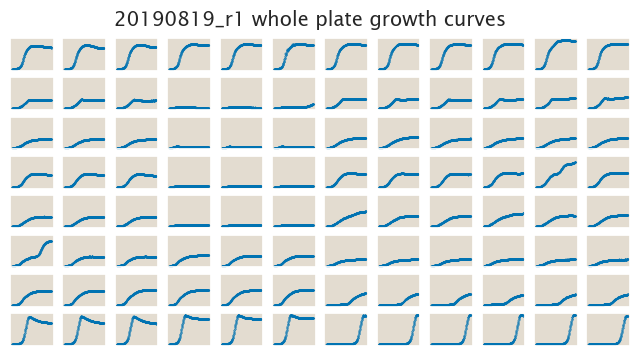
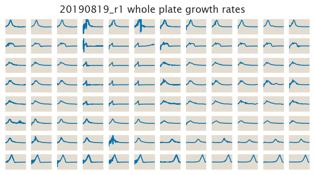

# 2019-08-19 Plate Reader Growth Measurement

## Purpose
The purpose of this experiment was to test the functionality of the single
gene selection plasmid
- pZS2*5-O2+11-galK-gfp
This construct is still on plasmid, not integrated into the genome. As
for now we just want to make sure that we obtain the expected qualitative
behavior for each of the selection cassette.

## Strain Information

| Plasmid | Genotype | Host Strain | Shorthand |
| :------ | :------- | ----------: | --------: |
| `none`| `∆lacI` |  HG105 |`HG105` |
| `none`| `∆lacI, ∆galK` |  HG105 |`∆galK` |
| `pZS2*5-O2+11-galK-gfp`| `∆lacI` |  HG105 |`O2-galK-tetA` |

## Notes & Observations
Everything ran smoothly for this experiment.

## Analysis Files

**Whole Plate Growth Curves**

**Whole Plate Growth Rate Inferences**

## Experimental Protocol

1. Cells as described in "Strain Information" were grown to saturation in 3 mL
of LB + Kan (when necessary) in 14 mL tubes.

2. Cells were diluted 1:10,000 into M9 + 0.5% glucose media on a new deep 96
well plate 12 hours before the experiment for cells to be at exponential growth.

3. The cells were then diluted 1:50 into the plate reader 96 well plate with a
total volume of 500 µL.

4. The plate was placed in a Biotek Gen5 plate reader and grown at 37C, shaking
in a linear mode at the fastest speed. Measurements were taken every 5 minutes
for approximately 24 hours. Three measurements were taken:
    a. OD600
    b. 510 excitation with 540 emission from the top of the plate
    b. 510 excitation with 540 emission from the bottom of the plate

