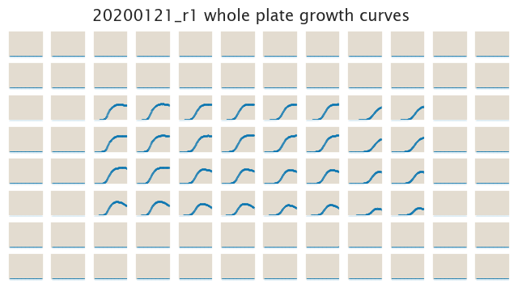
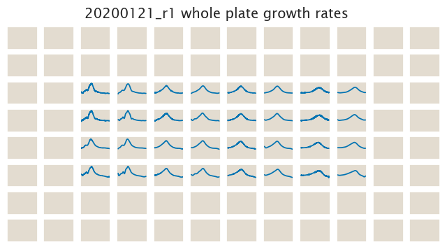

# 2020-01-21 Plate Reader Growth Measurement

## Purpose
This experiment aims to test the *galK<>O1+11-sacB-tetA* construct recently
integrated into the genome. Various tetracycline and sucrose concentrations
were used to explore the growth rate of cells harboring this construct.

## Strain Information

| Plasmid | Genotype | Host Strain | Shorthand |
| :------ | :------- | ----------: | --------: |
| `pZS4*5-mCherry`| `galK<>25O1+11-sacB-tetA-C51m` |  HG105 |`O1 R0 ST` |

## Notes & Observations

## Analysis Files

**Whole Plate Growth Curves**

**Whole Plate Growth Rate Inferences**

## Experimental Protocol

1. Cells as described in "Strain Information" were grown to saturation in 5 mL
of LB in a 14 mL culture tube.

2. Cells were diluted 1:1000 into 300 µL of M9 + 0.5% glucose media on a glass
   bottom 96 well plate. Each of the rows and columns had different
   concentrations of sucrose (negative selection due to *sacB*) and
   tetracycline (positive selection due to *tetA*). See plate for specific
   concentrations.

4. The plate was placed in a Biotek Gen5 plate reader and grown at 37ºC, shaking
in a linear mode at the fastest speed. Measurements were taken every 10 minutes
for approximately 30 hours.