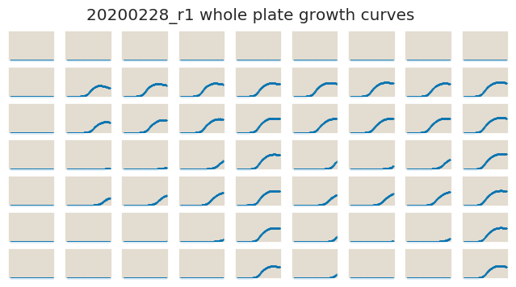

# 2020-02-28 Plate Reader Growth Measurement

## Purpose
This experiment aims to measure the growth rate of the *E. coli* strains of interest in media with selection for resistance to the antibiotic tetracycline.

## Strain Information

| Plasmid | Genotype | Host Strain | Shorthand |
| :------ | :------- | ----------: | --------: |
| `pZS4*5-mCherry`| `galK<>25O1+11-tetA-cmR-YFP`, , `ybcN<>4*5-RBS1L-lacI` |  HG105 |`O1 R1740` |
| `pZS4*5-mCherry`| `galK<>25O1+11-tetA-cmR-YFP`, `ybcN<>4*5-RBS1027-lacI` |  HG105 |`O1 R260` |
| `pZS4*5-mCherry`| `galK<>25O1+11-tetA-cmR-YFP` |  HG104 |`O1 R22` |
| `pZS4*5-mCherry`| `galK<>25O1+11-tetA-cmR-YFP` |  HG105 |`O1 R0` |
| `pZS4*5-CFP`| `galK<>25O1+11-tetA-cmR-YFP`, , `ybcN<>4*5-RBS1L-lacI` |  HG105 |`O1 R1740` |
| `pZS4*5-CFP`| `galK<>25O1+11-tetA-cmR-YFP`, `ybcN<>4*5-RBS1027-lacI` |  HG105 |`O1 R260` |
| `pZS4*5-CFP`| `galK<>25O1+11-tetA-cmR-YFP` |  HG104 |`O1 R22` |
| `pZS4*5-CFP`| `galK<>25O1+11-tetA-cmR-YFP` |  HG105 |`O1 R0` |

## Notes & Observations
Concentrations for row 4 and 5 are switched. 

## Analysis Files

**Whole Plate Growth Curves**

**Whole Plate Growth Rate Inferences**

## Experimental Protocol

1. Cells as described in "Strain Information" were grown to saturation in 4 mL
of LB in 14ml growth tubes.

2. Cells were diluted 1:1,000 into M9 + 0.5% glucose media in new deep growth tubes for 8 hours before the experiment for cells to be at exponential growth.

3. The cells were then diluted 1:100 into the plate reader 96 well plate with a
total volume of 300 µL.

4. The plate was placed in a Biotek Gen5 plate reader and grown at 37C, shaking
in a linear mode at the fastest speed. Measurements were taken every 5 minutes
for approximately 28 hours.
