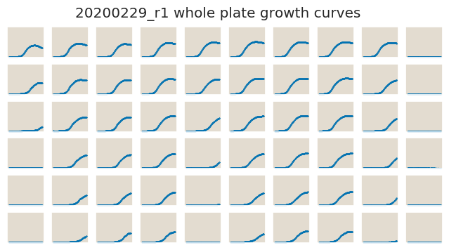
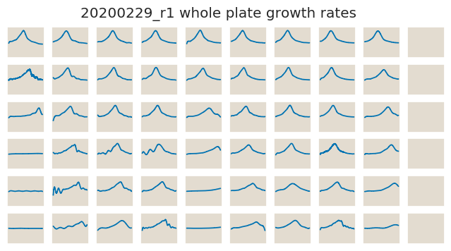

# 2020-02-29 Plate Reader Growth Measurement

## Purpose
This experiment aims to explore resistance of different *E. coli* strains to tetracycline. We integrated the O3 repressor binding site and the tetA gene into the genome of
cells with different repressor copy numbers. Here we try to find a range of tetracycline concentrations where we can identify different growth rates, and check if we can
see differences in growth rates at equal concentrations between cells with different repressor copy numbers.

## Strain Information

| Plasmid | Genotype | Host Strain | Shorthand |
| :------ | :------- | ----------: | --------: |
| `pZS4*5-mCherry`| `galK<>25O3+11-tetA-C51m`, , `ybcN<>5-RBS1L-lacI` |  HG105 |`O3 R1740 mCh` |
| `pZS4*5-mCherry`| `galK<>25O3+11-tetA-C51m`, `ybcN<>5-RBS1027-lacI` |  HG105 |`O3 R260mCh` |
| `pZS4*5-mCherry`| `galK<>25O3+11-tetA-C51m` |  HG104 |`O3 R22 mCh` |
| `pZS4*5-mCherry`| `galK<>25O3+11-tetA-C51m` |  HG105 |`O3 R0 mCh` |
| `pZS4*5-CFP`| `galK<>25O3+11-tetA-C51m`, , `ybcN<>5-RBS1L-lacI` |  HG105 |`O3 R1740 CFP` |
| `pZS4*5-CFP`| `galK<>25O3+11-tetA-C51m`, `ybcN<>5-RBS1027-lacI` |  HG105 |`O3 R260 CFP` |
| `pZS4*5-CFP`| `galK<>25O3+11-tetA-C51m` |  HG104 |`O3 R22 CFP` |
| `pZS4*5-CFP`| `galK<>25O3+11-tetA-C51m` |  HG105 |`O3 R0 CFP` |
| `pZS4*5-CFP`| `galK` |  HG105 |`WT` |

## Notes & Observations

## Analysis Files

**Whole Plate Growth Curves**

**Whole Plate Growth Rate Inferences**

## Experimental Protocol

1. Cells as described in "Strain Information" were grown to saturation in 4 mL
of LB in 14ml growth tubes.

2. Cells were diluted 1:1,000 into M9 + 0.5% glucose media in new deep growth tubes for 8 hours before the experiment for cells to be at exponential growth.

3. The cells were then diluted 1:100 into the plate reader 96 well plate with a
total volume of 300 µL.

4. The plate was placed in a Biotek Gen5 plate reader and grown at 37C, shaking
in a linear mode at the fastest speed. Measurements were taken every 5 minutes
for approximately 24 hours.
