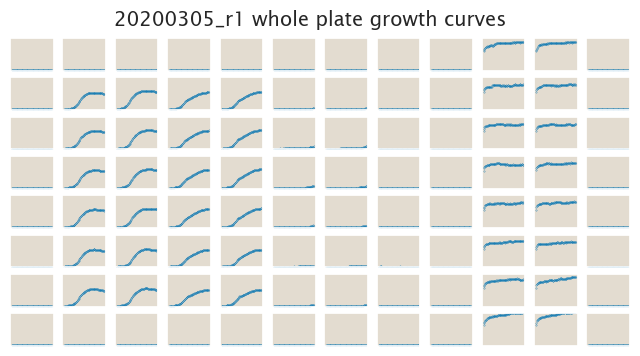
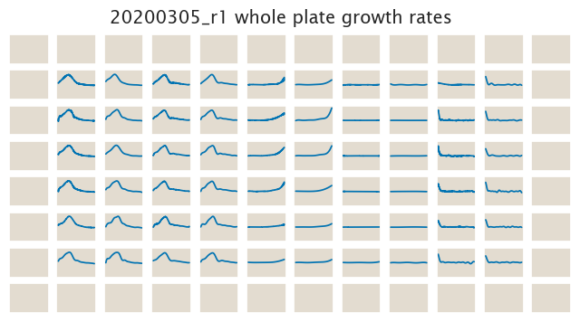

# 2020-03-05 Plate Reader Growth Measurement

## Purpose
This experiment aims to measure the growth rate of strains with a variety of
repressor copy numbers regulating the O2-mediated expression of TetA
constitutively expressing mCherry across a NiCl2 gradient. 

We are still at an exploratory phase trying to find the right NiCl2
concentrations to act as a negative selection that doesn't completely inhibit
growth, but only decreases the growth rate.

## Strain Information

| Plasmid | Genotype | Host Strain | Shorthand |
| :------ | :------- | ----------: | --------: |
| `pZS4*5-mCherry`| `galK<>25O2+11-tetA-C51m` |  HG105 |`R0` |
| `pZS4*5-mCherry`| `galK<>25O2+11-tetA-C51m` |  HG104 |`R22` |
| `pZS4*5-mCherry`| `galK<>25O2+11-tetA-C51m`, `ybcN<>5-RBS1027-lacI` |  HG105 |`R260` |
| `pZS4*5-mCherry`| `galK<>25O2+11-tetA-C51m`, `ybcN<>5-RBS1L-lacI` |  HG105 |`R1740` |
| `pZS4*5-mCherry`| -- |  HG105 |`WT` |

## Selection Concentrations
| Selection Pressure | Concentration |
| :--: | :--: |
|NiCl2 | 0, 0.01, 0.1, 1, 10 mM |

## Notes & Observations
This experiment was done with a new 1 M NiCl2 stock prepared in water rather than M9 media.
The NiCl2 went into solution very easily in water (in an exothermic reaction). But when the
100 µL were aded to the 9.9 mL of M9 media to prepare the 10 mM media, it became really
cloudy. It seems that the salt has a hard time going into solution

## Analysis Files

**Whole Plate Growth Curves**

**Whole Plate Growth Rate Inferences**

## Experimental Protocol

1. Cells as described in "Strain Information" were grown to saturation in 3 mL
of LB at 37°C with aeration to saturation. 

2. Cells were diluted 1:1000 into M9 + 0.5% glucose media (3 mL) with
   spectinomycin in 14 mL falcon tubes and were allowed to grow unitl saturation
   

3. Cells were then diluted 1:50. This means 6 µL of saturated culture into 296 µL
    of M9 + 0.5% glucose the appropriate concentration of the
    selection agent all in a glass-bottom 96-well plate. 

4. The OD of the plate was read every 15 minutes for ≈ 30 hours or until the
   strains reached saturation.
