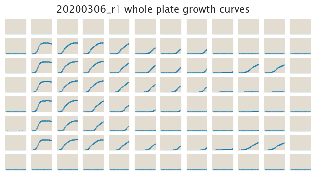
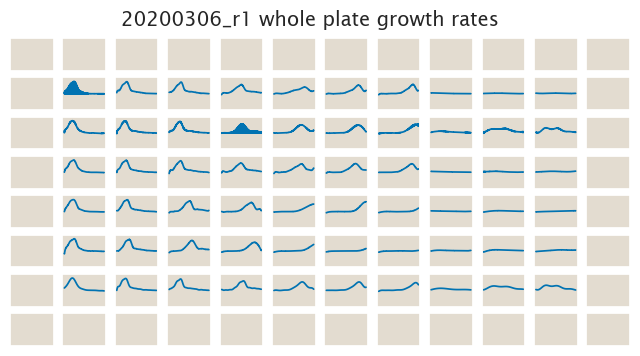

# 2020-03-06 Plate Reader Growth Measurement

## Purpose
In this experiment we are trying to nail down a finer range of NiCl2 concentrations
to use. From the 2020-03-05 experiment we found that between 10 µM and 100 µM there
is a notorious difference in growth. So for here we decided to test concentrations
in this range.

## Strain Information

| Plasmid | Genotype | Host Strain | Shorthand |
| :------ | :------- | ----------: | --------: |
| `pZS4*5-mCherry`| `galK<>25O2+11-tetA-C51m` |  HG105 |`R0` |
| `pZS4*5-mCherry`| `galK<>25O2+11-tetA-C51m` |  HG104 |`R22` |
| `pZS4*5-mCherry`| `galK<>25O2+11-tetA-C51m`, `ybcN<>5-RBS1027-lacI` |  HG105 |`R260` |
| `pZS4*5-mCherry`| `galK<>25O2+11-tetA-C51m`, `ybcN<>5-RBS1L-lacI` |  HG105 |`R1740` |
| `pZS4*5-mCherry`| -- |  HG105 |`WT` |

## Selection Concentrations
| Selection Pressure | Concentration |
| :--: | :--: |
|NiCl2 | 0, 10, 20, 40, 60, 80, 100 µM |
|Tetracycline | 0, 3 µg/mL |

## Notes & Observations
In this experiment we started from a 1:1000 dilution of our 1M stock of NiCl2. This at
the beginning seemed to crash out of solution, but upon vortexing the media went back
to transparent.

## Analysis Files

**Whole Plate Growth Curves**

**Whole Plate Growth Rate Inferences**

## Experimental Protocol

1. Cells as described in "Strain Information" were grown to saturation in 3 mL
of LB at 37°C with aeration to saturation. 

2. Cells were diluted 1:1000 into M9 + 0.5% glucose media (3 mL) with
   spectinomycin in 14 mL falcon tubes and were allowed to grow unitl saturation

3. Cells were then diluted 1:50. This means 6 µL of saturated culture into 296 µL
    of M9 + 0.5% glucose the appropriate concentration of the
    selection agent all in a glass-bottom 96-well plate. 

4. The OD of the plate was read every 15 minutes for ≈ 30 hours or until the
   strains reached saturation.
