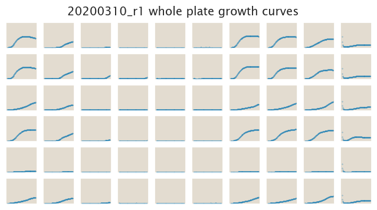
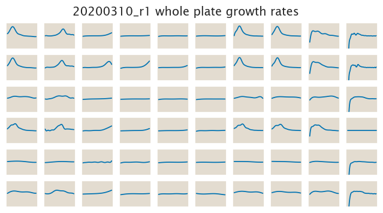

# 2020-03-10 Plate Reader Growth Measurement

## Purpose
The objective of this experiment is to continue exploring the range of
concentrations for NiCl2 to act as a negative selection. We will also explore
the apparent synergy that took place when NiCl2 was present with tetracycline.
Furthermore we will begin the tests of a new negative selection agent known as
**disulfiram**. This new drug will also be put in combination with tetracycline
to know if there is also some synergy between both drugs.

## Strain Information

| Plasmid | Genotype | Host Strain | Shorthand |
| :------ | :------- | ----------: | --------: |
| `pZS4*5-mCherry`| `wild type` |  HG105 |`wt` |
| `pZS4*5-mCherry`| `galK<>25O2+11-tetA-C51m` |  HG105 |`O2 ∆` |

## Notes & Observations
When preparing the highest concentration of Disulfiram I went from a 50 mM
stock to a 1 mM stock. This - just as NiCl2 - created a really cloudy solution
since something crashed out of the solution.

## Analysis Files

**Whole Plate Growth Curves**

**Whole Plate Growth Rate Inferences**

## Experimental Protocol

1. Cells as described in "Strain Information" were grown to saturation in 4 mL
of LB in a deep 96 well plate.

2. Cells were diluted 1:1000 into 4 mL of M9 + 0.5% glucose media in culture
   tubes and grown until saturation.

3. The cells were then diluted 1:50 into the plate reader 96 well plate with a
total volume of 300 µL.

4. The plate was placed in a Biotek Gen5 plate reader and grown at 37C, shaking
in a linear mode at the fastest speed. Measurements were taken every 15 minutes
for approximately 20 hours.