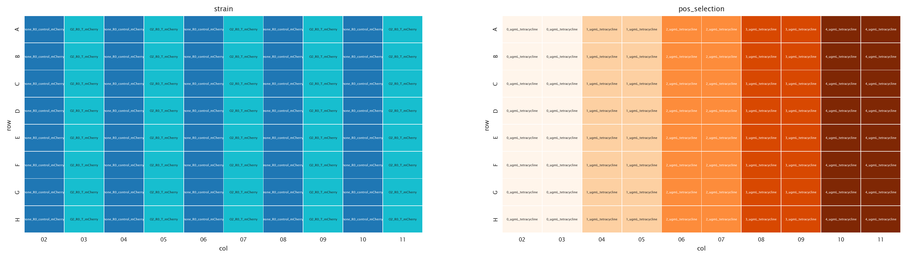
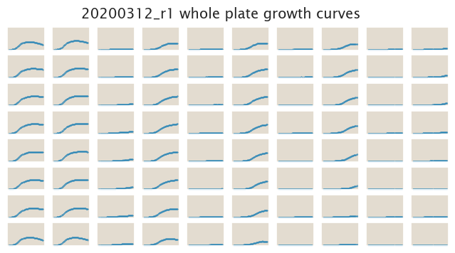
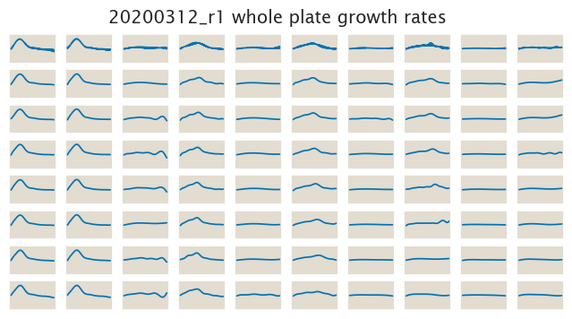

# 2020-03-12 Plate Reader Growth Measurement

## Purpose
The objective of this experiment is to gather very accurate data for the growth
of the ∆lacI strain on different tetracycline concentrations. So far we have
been testing different concentrations not worrying too much about technical and
biological repeats. But this dataset aims to get data that will be used to fit
growth-related parameters for our model.

## Strain Information

| Plasmid | Genotype | Host Strain | Shorthand |
| :------ | :------- | ----------: | --------: |
| `pZS4*5-mCherry`| `wild type` |  HG105 |`wt` |
| `pZS4*5-mCherry`| `galK<>25O2+11-tetA-C51m` |  HG105 |`O2 ∆` |

## Plate Layout

**96 plate layout**

## Notes & Observations

## Analysis Files

**Whole Plate Growth Curves**

**Whole Plate Growth Rate Inferences**

## Experimental Protocol

1. Cells as described in "Strain Information" were grown to saturation in 4 mL
   of LB in a deep 96 well plate.

2. Cells were diluted 1:1000 into 4 mL of M9 + 0.5% glucose media in culture
   tubes and grown until saturation.

3. The cells were then diluted 1:50 into the plate reader 96 well plate with a
   total volume of 300 µL.

4. The plate was placed in a Biotek Gen5 plate reader and grown at 37ºC,
   shaking in a linear mode at the fastest speed. Measurements were taken every
   15 minutes for approximately 20 hours.