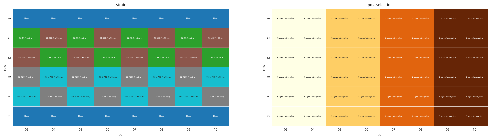
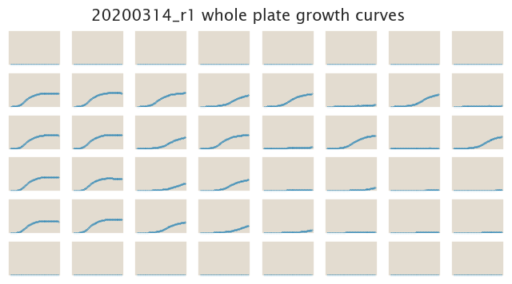
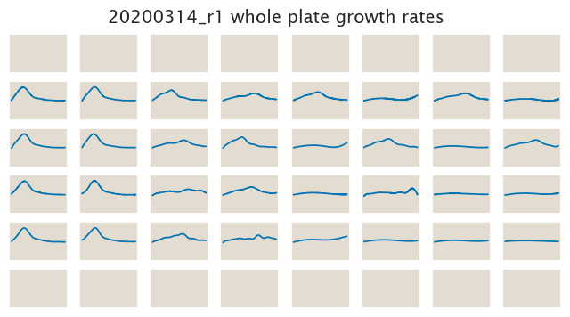

# 2020-03-14 Plate Reader Growth Measurement
The objective of this experiment is to measure the growth rate differences of
all of the O2 constructs with more precision.

## Purpose

## Strain Information

| Plasmid | Genotype | Host Strain | Shorthand |
| :------ | :------- | ----------: | --------: |
| `pZS4*5-mCherry`| `wild type` |  HG105 |`wt` |
| `pZS4*5-mCherry`| `galK<>25O2+11-tetA-C51m` |  HG105 |`O2 ∆` |
| `pZS4*5-mCherry`| `galK<>25O2+11-tetA-C51m` |  HG104 |`O2 R22` |
| `pZS4*5-mCherry`| `galK<>25O2+11-tetA-C51m`, `ybcN<>5-RBS1027-lacI` |  HG104 |`O2 R260` |
| `pZS4*5-mCherry`| `galK<>25O2+11-tetA-C51m`, `ybcN<>5-RBS1L-lacI` |  HG104 |`O2 R1740` |

## Plate Layout

**96 plate layout**

## Notes & Observations
The plate was arranged in a checkerboard way using only the 4 central rows of
the plate to remove biases in oxygenation and therefore growth rate for
different sections of the plate.

## Analysis Files

**Whole Plate Growth Curves**

**Whole Plate Growth Rate Inferences**

## Experimental Protocol

1. Cells as described in "Strain Information" were grown to saturation in 4 mL
   of LB in a deep 96 well plate.

2. Cells were diluted 1:1000 into 4 mL of M9 + 0.5% glucose media in culture
   tubes and grown until saturation.

3. The cells were then diluted 1:50 into the plate reader 96 well plate with a
   total volume of 300 µL.

4. The plate was placed in a Biotek Gen5 plate reader and grown at 37ºC,
   shaking in a linear mode at the fastest speed. Measurements were taken every
   15 minutes for approximately 20 hours.
