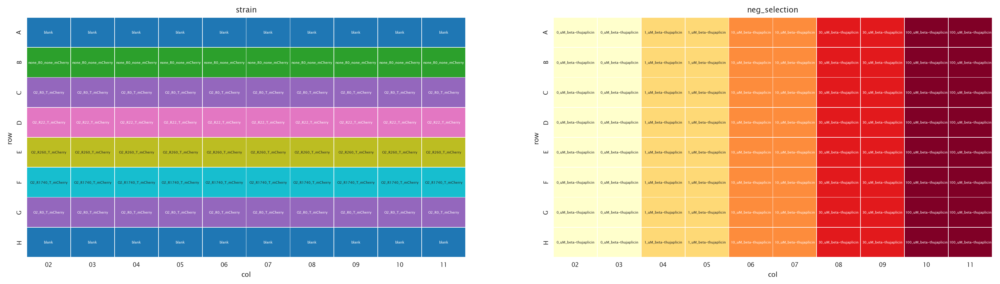
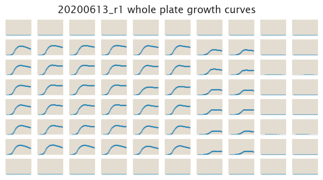
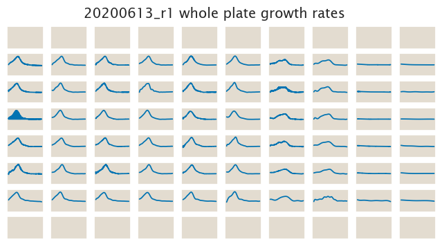

# 2020-06-13 Plate Reader Growth Measurement

## Purpose
The purpose of this experiment is to check the effectiveness of the negative
selction given by the small molecule β-thujaplicin on cells expressing the TetA
efflux pump.

## Strain Information

| Plasmid | Genotype | Host Strain | Shorthand |
| :------ | :------- | ----------: | --------: |
| `pZS4*5-mCherry`| `wild-type` |  HG105 |`HG105` |
| `pZS4*5-mCherry`| `galK<>25O2+11-tetA-C51m` |  HG105 |`O2 R0` |
| `pZS4*5-mCherry`| `galK<>25O2+11-tetA-C51m` |  HG104 |`O2 R22` |
| `pZS4*5-mCherry`| `galK<>25O2+11-tetA-C51m`, `ybcN<>4*5-RBS1027-lacI` |  HG105 |`O2 R260` |
| `pZS4*5-mCherry`| `galK<>25O2+11-tetA-C51m`, , `ybcN<>4*5-RBS1L-lacI` |  HG105 |`O2 R1740` |

## Plate Layout

**96 plate layout**

## Notes & Observations

## Analysis Files

**Whole Plate Growth Curves**

**Whole Plate Growth Rate Inferences**

## Experimental Protocol

1. Cells as described in "Strain Information" were grown to saturation in 4 mL
   of LB + Kan + Spec (except `HG105` with Spec only) in 14 mL culture tubes.

2. Cells were diluted 1:1000 into 4 mL of M9 + 0.5% glucose + Kan + Spec (except
   `HG105` with Spec only) ≈ 8 hours after the initial inoculation to adapt
   cells into the M9 media.

3. The cells were then diluted 1:100 into the plate reader 96 well plate with a
   total volume of 300 µL.
    
- Note: For the plate preparation the β-thujaplicin came from a 15 mg/mL stock
  (≈90 mM) in DMSO stored at -20ºC. This was gently thawed before the experiment
  and for each of the concentrations in the experiment a 60x solution was
  prepared in order to add 5 µL of this 60x dilution to 295 µL of media in the
  96-well plate.

4. The plate was placed in a Biotek Gen5 plate reader and grown at 37ºC, shaking
   in a linear mode at the fastest speed. Measurements were taken every 15
   minutes for approximately 36 hours.

## Conclusions

The conclusions on this section come from the qualitative exploration of the
data. In particular the file `growth_plate_reader_exploration.ipynb` with its
interactive plots helped us reach these conclusions.

The data does not follow the expected trend whatsoever. There are several issues
with the data:
- The `O2-R0` strain presents completely different behaviors for each of the
  rows where it was inoculated.
- The trend does not follow what we expect for the negative selection. The
  expected case was that the strain with the highest number of repressors would
  have the highest growth rate among the strains expressing *tetA*. But this
  starin presents a weird behavior. We know from the experiment on `20200314`
  that this strain seems to fall out of the expected trends. So this suggests
  again a contamination issue that needs to be addressed.

What we did learn from the experiment is that the **best concentration of
β-thujaplicin lies between 30 and 100 µM**. Future explorations will have to
span this range to nail down the best values.