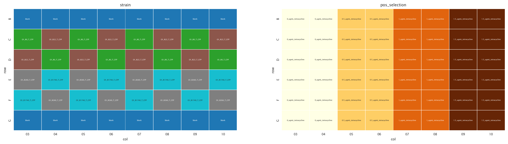
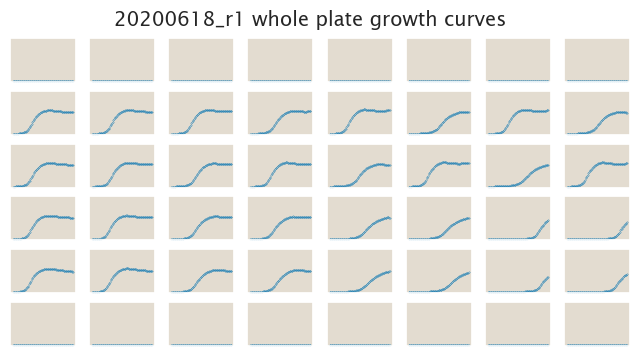
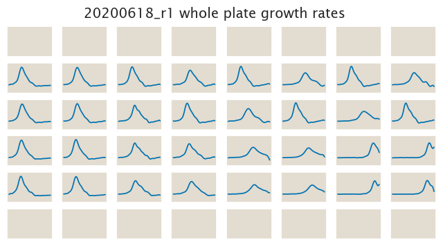

# 2020-06-18 Plate Reader Growth Measurement

## Purpose
This experiment will recollect high quality data for the growth of the O1-tetA
strains in tetracycline using a checker board pattern.

## Strain Information

| Plasmid | Genotype | Host Strain | Shorthand |
| :------ | :------- | ----------: | --------: |
| `pZS4*5-CFP`| `galK<>25O1+11-tetA-C51m` |  HG105 |`O1 R0` |
| `pZS4*5-CFP`| `galK<>25O1+11-tetA-C51m` |  HG104 |`O1 R22` |
| `pZS4*5-CFP`| `galK<>25O1+11-tetA-C51m`, `ybcN<>4*5-RBS1027-lacI` |  HG105 |`O1 R260` |
| `pZS4*5-CFP`| `galK<>25O1+11-tetA-C51m`, , `ybcN<>4*5-RBS1L-lacI` |  HG105 |`O1 R1740` |

## Plate Layout

**96 plate layout**

## Notes & Observations

## Analysis Files

**Whole Plate Growth Curves**

**Whole Plate Growth Rate Inferences**

## Experimental Protocol

1. Cells as described in "Strain Information" were grown to saturation in 4 mL
   of LB + Kan + Spec (except `HG105` with Spec only) in 14 mL culture tubes.

2. Cells were diluted 1:1000 into 4 mL of M9 + 0.5% glucose + Kan + Spec (except
   `HG105` with Spec only) ≈ 8 hours after the initial inoculation to adapt
   cells into the M9 media.

3. The cells were then diluted 1:100 into the plate reader 96 well plate with a
   total volume of 300 µL.
    
- Note: For the plate preparation the tetracycline came from a 5 mg/mL stock
  stored at -20ºC. For each of the concentrations in the experiment a 60x
  solution was prepared in order to add 5 µL of this 60x dilution to 295 µL of
  media in the 96-well plate.

4. The plate was placed in a Biotek Gen5 plate reader and grown at 37ºC, shaking
   in a linear mode at the fastest speed. Measurements of both OD600 and YFP
   were taken every 15 minutes for approximately 24 hours.

## Conclusions

The data looks decent. The rank order of the growth rates looks roughly okay, 
except that there is no clear distinction between R260 and R740. This might be
expected given that for O1 strains the expression at this point might be not 
that different since both strains are highly repressed.
