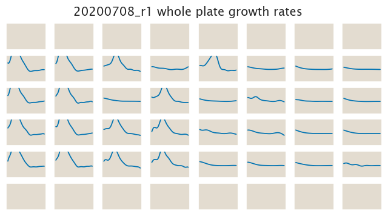

# 2020-07-08 Plate Reader Growth Measurement

## Purpose
The objective of this experiment is to test again the growth on the alleged
negative selection β-thujaplicin. Our previous experiment with the O2-tetA
strains didn't give the expected trend. Since we suspect some contamination in
one of the strains, that data cannot be directly trusted. For this experiment we
will use the well behaved O1-tetA/CFP strains to test the growth on
β-thujaplicin.

## Strain Information

| Plasmid | Genotype | Host Strain | Shorthand |
| :------ | :------- | ----------: | --------: |
| `pZS4*5-CFP`| `galK<>25O1+11-tetA-C51m` |  HG105 |`O1 R0` |
| `pZS4*5-CFP`| `galK<>25O1+11-tetA-C51m` |  HG104 |`O1 R22` |
| `pZS4*5-CFP`| `galK<>25O1+11-tetA-C51m`, `ybcN<>4*5-RBS1027-lacI` |  HG105 |`O1 R260` |
| `pZS4*5-CFP`| `galK<>25O1+11-tetA-C51m`, , `ybcN<>4*5-RBS1L-lacI` |  HG105 |`O1 R1740` |

## Plate Layout

**96 plate layout**

## Notes & Observations

This experiment had a ≈ 10x higher initial inoculum size. This to test if
starting with a much higher number of cells removes the initial delay phase in
the growth curve.

## Analysis Files

**Whole Plate Growth Curves**

**Whole Plate Growth Rate Inferences**

## Experimental Protocol

1. Cells as described in "Strain Information" were grown to saturation in 4 mL
   of LB + Kan + Spec in 14 mL culture tubes.

2. Cells were diluted 1:4000 into 4 mL of M9 + 0.5% glucose + Kan + Spec ≈ 8
    hours after the initial inoculation to adapt cells into the M9 media.

3. 1 mL of saturated overnight M9 cultures was spun down at top speed for 30
   sec. The media was removed and pellets were diluted into 100µL of fresh M9
   to generate a 10x concentration of cells.

4. 5µL of this 10x culture were then added  into the plate reader 96 well plate
   with a total volume of 305 µL.
    
- Note: For the plate preparation the β-thujaplicin came from a 90 µM stock
  stored at -20ºC. For each of the concentrations in the experiment a 60x
  solution was prepared in order to add 5 µL of this 60x dilution to 295 µL of
  media in the 96-well plate.

5. The plate was placed in a Biotek Gen5 plate reader and grown at 37ºC, shaking
   in a linear mode at the fastest speed. Measurements of both OD600 and YFP
   were taken every 15 minutes for approximately 24 hours.