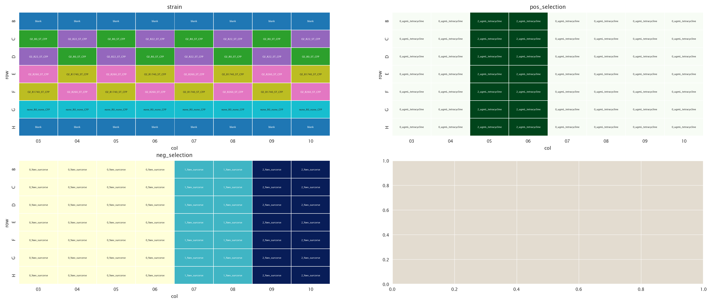
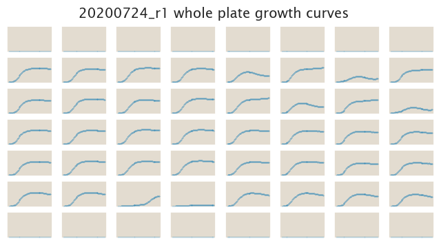
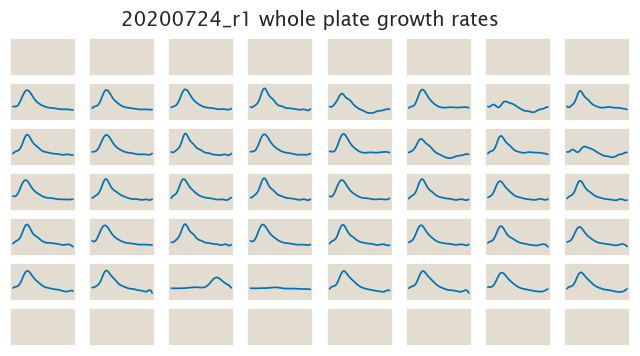

# 2020-07-24 Plate Reader Growth Measurement

## Purpose
Now that we have decided that the tetA single gene construct were not taking us
in the right direction is time to start testing a different strategy. The
objective of this experiment is to measure the effect of both positive selection
(tetracycline) and negative selection (sucrose) on the O2+11-sacB-tetA-c51m
constructs.

## Strain Information

| Plasmid | Genotype | Host Strain | Shorthand |
| :------ | :------- | ----------: | --------: |
| `pZS4*5-mCherry`| `none` |  HG105 |`HG105` |
| `pZS4*5-mCherry`| `galK<>25O2+11-sacB-tetA-c51m` |  HG105 |`O2 R0` |
| `pZS4*5-mCherry`| `galK<>25O2+11-sacB-tetA-c51m` |  HG104 |`O2 R22` |
| `pZS4*5-mCherry`| `galK<>25O2+11-sacB-tetA-c51m`, `ybcN<>4*5-RBS1027-lacI` |  HG105 |`O2 R260` |
| `pZS4*5-mCherry`| `galK<>25O2+11-sacB-tetA-c51m`, , `ybcN<>4*5-RBS1L-lacI` |  HG105 |`O2 R1740` |

## Plate Layout

**96 plate layout**

## Notes & Observations

## Analysis Files

**Whole Plate Growth Curves**

**Whole Plate Growth Rate Inferences**

## Experimental Protocol

1. Cells as described in "Strain Information" were grown to saturation in 4 mL
   of LB + Spec + Kan (except `HG105`) in 14 mL culture tubes at 37ºC.

2. After ≈ 8 hours, when the LB cultures were saturated, cells were diluted
   1:1,000 into M9 + 0.5% glucose media + corresponding antibiotics and grown 
   overnight for ≈ 18 hours at 37ºC.

3. 10 µL of these saturated cultures were added to 300 µL of the corresponding
   media according to the plate layout.
   

4. The plate was placed in a Biotek Gen5 plate reader and grown at 37ºC, shaking
   in a linear mode at the fastest speed. Measurements of OD600 were taken every
   25 minutes for approximately 24 hours.

# Conclusions

The conclusions are based on a qualitative assessment of the data done with the
`growth_curve_exploration.ipynb` file.

At this concentration it seems as if only the R0 strain is being affected by the
sucrose in both concentrations. Probably a higher concentration of sucrose could
clarify this lack of effect on all other strains.