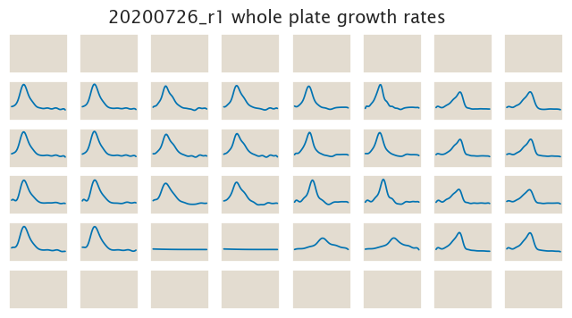

# 2020-07-26 Plate Reader Growth Measurement

## Purpose
This experiment will test the response of the `O2+11-sacB-tetA` constructs to 
the negative selections for the *tetA* gene. This experiment is a followup to
the observation that the `sacB-tetA` constructs seem to have an incredibly high
resistance to tetracycline compared to the `tetA` only constructs. This then let
us to believe that maybe these constructs will present the expected negative 
selection to disulfiram and/or β-thujaplicin.

## Strain Information

| Plasmid | Genotype | Host Strain | Shorthand |
| :------ | :------- | ----------: | --------: |
| `pZS4*5-mCherry`| `none` |  HG105 |`HG105` |
| `pZS4*5-mCherry`| `galK<>25O1+11-sacB-tetA-c51m` |  HG105 |`O1 R0` |
| `pZS4*5-mCherry`| `galK<>25O1+11-sacB-tetA-c51m`, `ybcN<>4*5-RBS1027-lacI` |  HG105 |`O1 R260` |
| `pZS4*5-mCherry`| `galK<>25O1+11-sacB-tetA-c51m`, , `ybcN<>4*5-RBS1L-lacI` |  HG105 |`O1 R1740` |

## Plate Layout

**96 plate layout**

## Notes & Observations

## Analysis Files

**Whole Plate Growth Curves**

**Whole Plate Growth Rate Inferences**

## Experimental Protocol

1. Cells as described in "Strain Information" were grown to saturation in 4 mL
   of LB + Spec + Kan (except `HG105`) in 14 mL culture tubes at 37ºC.

2. After ≈ 8 hours, when the LB cultures were saturated, cells were diluted
   1:1,000 into M9 + 0.5% glucose media + corresponding antibiotics and grown 
   overnight for ≈ 18 hours at 37ºC.

3. 10 µL of these saturated cultures were added to 300 µL of the corresponding
   media according to the plate layout.

4. The plate was placed in a Biotek Gen5 plate reader and grown at 37ºC, shaking
   in a linear mode at the fastest speed. Measurements of OD600 were taken every
   25 minutes for approximately 24 hours.

# Conclusions

The conclusions listed here were obtained from a qualitative assessment of the 
data based on the analysis in the `growth_plate_reader_expliration.ipynb` file.

The 25 µg/mL tetracycline were not even close to the MIC concentration for these
constructs despite being more than 10 times larger to a concentration that
inhibited the growth of the pure *tetA* constructs.

As for the negative selection on *tetA* with both disulfiram and β-thujaplicin,
these data don't show the expected trend. If anything it again shows the
opposite trend expected with the most repressed strain having the smallest
growth rate. Very confusing again.