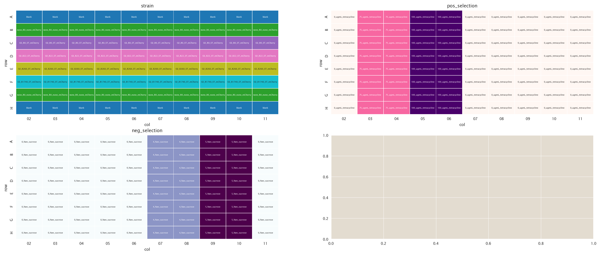
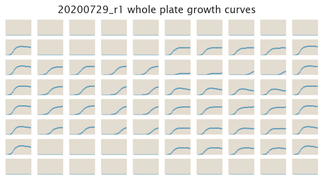
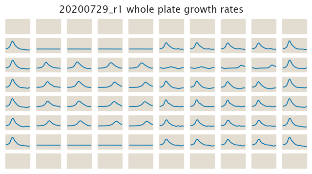

# 2020-07-29 Plate Reader Growth Measurement

## Purpose
Having found the MIC for both tetracycline and sucrose for the unregulated
strains now we will assess quantitatively if we can distinguish the growth of
different strains.

## Strain Information

| Plasmid | Genotype | Host Strain | Shorthand |
| :------ | :------- | ----------: | --------: |
| `pZS4*5-mCherry`| `none` |  HG105 |`HG105` |
| `pZS4*5-mCherry`| `galK<>25O2+11-sacB-tetA-C51m` |  HG105 |`O2 R0` |
| `pZS4*5-mCherry`| `galK<>25O2+11-sacB-tetA-C51m` |  HG104 |`O2 R22` |
| `pZS4*5-mCherry`| `galK<>25O2+11-sacB-tetA-C51m`, `ybcN<>4*5-RBS1027-lacI` |  HG105 |`O2 R260` |
| `pZS4*5-mCherry`| `galK<>25O2+11-sacB-tetA-C51m`, , `ybcN<>4*5-RBS1L-lacI` |  HG105 |`O2 R1740` |

## Plate Layout

**96 plate layout**

## Notes & Observations

## Analysis Files

**Whole Plate Growth Curves**

**Whole Plate Growth Rate Inferences**

## Experimental Protocol

1. Cells as described in "Strain Information" were grown to saturation in 4 mL
   of LB + Spec + Kan (except HG105) in a deep 96 well plate.

2. After ≈ 8 hours cells were diluted 1:4,000 into 4 mL of M9 + 0.5% glucose to
   grow overnight in this media.

3. 10 µL of saturated M9 cultures were added to 300 µL of media according to the
   plate layout.

4. The plate was placed in a Biotek Gen5 plate reader and grown at 37ºC, shaking
   in a linear mode at the fastest speed. Measurements were taken every 25
   minutes for approximately 24 hours.

## Conclusions

The conclusions presented here come from a qualitative assessment of the data 
done with the `growth_plate_reader_exploration.ipynb` file.

The selection seems to go in the right trend. This is especially obvious for
the positive selection with tetracycline, but less clear for the negative 
selection with sucrose. The difference between the regulated strains is small
to notice for this case. A bit of IPTG induction could accentuate the 
differences between strains. But this is going in the right direction.