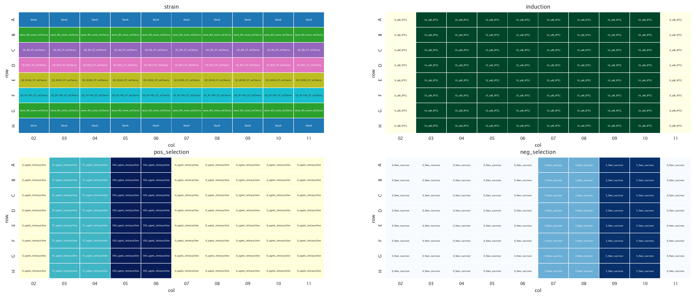
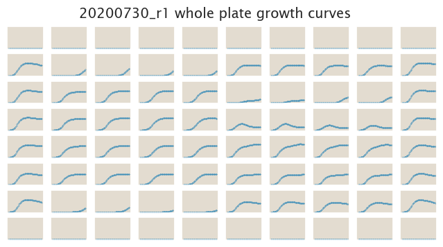
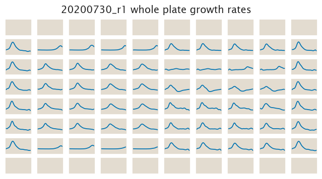

# 2020-07-30 Plate Reader Growth Measurement

## Purpose
Based on the experiment from `20200729` we observed that the expression level
difference between strains is not large enough to see a big separation between
the different regulated strains. Only the unregulated strain shows clearly 
different levels of fitness for the different selections.

To accentuate the expected differences between strains we chose to induce them
with **10 µM IPTG**. Therefore this experiment will test the fitness differences
one obtains when the expression level is adjusted with this induction level. The
choice of induction was based on the induction curve presented in [Razo-Mejia
et al., 2018](https://www.cell.com/fulltext/S2405-4712(18)30057-7).

## Strain Information

| Plasmid | Genotype | Host Strain | Shorthand |
| :------ | :------- | ----------: | --------: |
| `pZS4*5-mCherry`| `none` |  HG105 |`HG105` |
| `pZS4*5-mCherry`| `galK<>25O2+11-sacB-tetA-C51m` |  HG105 |`O2 R0` |
| `pZS4*5-mCherry`| `galK<>25O2+11-sacB-tetA-C51m` |  HG104 |`O2 R22` |
| `pZS4*5-mCherry`| `galK<>25O2+11-sacB-tetA-C51m`, `ybcN<>4*5-RBS1027-lacI` |  HG105 |`O2 R260` |
| `pZS4*5-mCherry`| `galK<>25O2+11-sacB-tetA-C51m`, , `ybcN<>4*5-RBS1L-lacI` |  HG105 |`O2 R1740` |

## Plate Layout

**96 plate layout**

## Notes & Observations

## Analysis Files

**Whole Plate Growth Curves**

**Whole Plate Growth Rate Inferences**

## Experimental Protocol

1. Cells as described in "Strain Information" were grown to saturation in 4 mL
   of LB + Spec + Kan (except HG105) in a deep 96 well plate.

2. After ≈ 8 hours cells were diluted 1:4,000 into 4 mL of M9 + 0.5% glucose  +
   10µM IPTG to grow overnight in this media.

3. 10 µL of saturated M9 cultures were added to 300 µL of media according to the
   plate layout.

4. The plate was placed in a Biotek Gen5 plate reader and grown at 37ºC, shaking
   in a linear mode at the fastest speed. Measurements were taken every 25
   minutes for approximately 24 hours.

## Conclusion

The conclusions listed here come from a qualitative assessment of the data done
with the `growth_plate_reader_exploration.ipynb` file.

The system doesn't seem to behave in the way we expected it to do so. What we
wanted was to have a system where the negative selection gave different fitness
values in the absence of induction to select for different levels of leakiness,
and the positive selection to have variable fitness levels when fully induced to
select for different levels of maximum expression.

First, from `20200729` we learned that as for the leakiness value there were
visible differences for the positive selection, but not for the negative
selection, which is the opposite of what we wanted. Now from this very dataset
we see that the opposite is true at moderate levels of induction. In other
words, when strains were slightly induce to increase their gene expression
differences, all of them grew very similarly for the positive selection, and
very differently for the negative selection.

So the system behaves exactly in the opposite way of what we wanted it to be.
The purpose of the project with our selection schemes then falls flat on its
face. Now from this very dataset we see that the opposite is true at moderate
levels of induction. In other words, when strains were slightly induce to
increase their gene expression differences, all of them grew very similarly for
the positive selection, and very differently for the negative selection.

So the system behaves exactly in the opposite way of what we wanted it to be.
The purpose of the project with our selection schemes then falls flat on its
face.