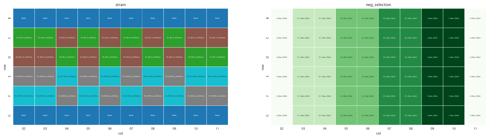
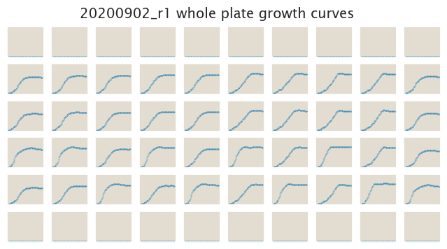
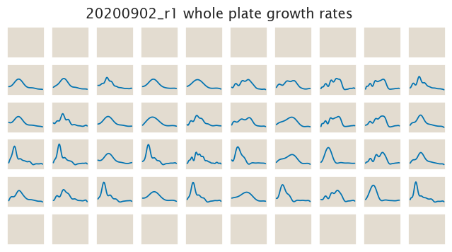

# 2020-09-02 Plate Reader Growth Measurement

## Purpose
Having finished the cloning of the O1-galK-gfp constructs is time to test them.
First we will test the negative selection given by 2-deoxy-D-galactose at
different concentrations to see if strains follow the expected trend.

## Strain Information

| Plasmid | Genotype | Host Strain | Shorthand |
| :------ | :------- | ----------: | --------: |
| `pZS4*5-mCherry`| `gspI<>25O1+11-galK-gfp` |  HG105 |`O1 R0` |
| `pZS4*5-mCherry`| `gspI<>25O1+11-galK-gfp` |  HG104 |`O1 R22` |
| `pZS4*5-mCherry`| `gspI<>25O1+11-galK-gfp`, `ybcN<>4*5-RBS1027-lacI` |  HG105 |`O1 R260` |
| `pZS4*5-mCherry`| `gspI<>25O1+11-galK-gfp`, , `ybcN<>4*5-RBS1L-lacI` |  HG105 |`O1 R1740` |

## Plate Layout

**96 plate layout**

## Notes & Observations

## Analysis Files

**Whole Plate Growth Curves**

**Whole Plate Growth Rate Inferences**

## Experimental Protocol

1. Cells as described in "Strain Information" were grown to saturation in 4 mL
   of LB + Spec + Chlor in 14 mL culture tubes at 37ºC.

2. 5 µL of these saturated cultures were added to 300 µL of the corresponding
   media according to the plate layout.

3. The plate was placed in a Biotek Gen5 plate reader and grown at 37ºC, shaking
   in a linear mode at the fastest speed. Measurements of OD600 were taken every
   25 minutes for approximately 24 hours.

## Conclusions

The conclusions listed here are obtained from a qualitative exploration of the
data using the `growth_plate_reader_exploration.ipynb` file.

These data shows some sort of promising trend, but it is not quite right.
Mainly, the no DoG control does not look okay, which automatically discards the
entire dataset.