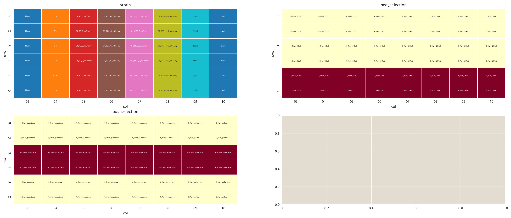
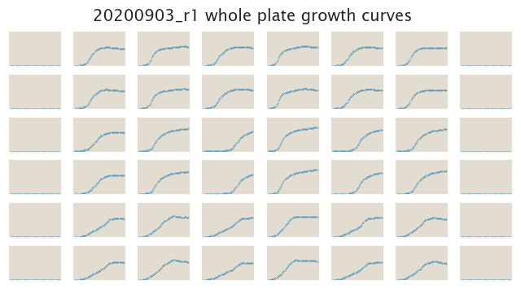
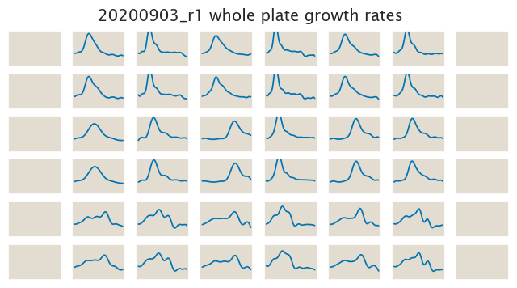

# 2020-09-03 Plate Reader Growth Measurement

## Purpose
In order to have a clear picture of how the positive and negative selection
works we'll test the O1-galK-gfp constructs in both, the positive and the
negative selection.

## Strain Information

| Plasmid | Genotype | Host Strain | Shorthand |
| :------ | :------- | ----------: | --------: |
| `pZS4*5-mCherry`| `none` |  HG105 |`HG105` |
| `pZS4*5-mCherry`| `galK<>cat` |  HG105 |`∆galK` |
| `pZS4*5-mCherry`| `gspI<>25O1+11-galK-gfp` |  HG105 |`O1 R0` |
| `pZS4*5-mCherry`| `gspI<>25O1+11-galK-gfp` |  HG104 |`O1 R22` |
| `pZS4*5-mCherry`| `gspI<>25O1+11-galK-gfp`, `ybcN<>4*5-RBS1027-lacI` |  HG105 |`O1 R260` |
| `pZS4*5-mCherry`| `gspI<>25O1+11-galK-gfp`, , `ybcN<>4*5-RBS1L-lacI` |  HG105 |`O1 R1740` |

## Plate Layout

**96 plate layout**

## Notes & Observations

## Analysis Files

**Whole Plate Growth Curves**

**Whole Plate Growth Rate Inferences**

## Experimental Protocol

1. Cells as described in "Strain Information" were grown to saturation in 4 mL
   of LB + Spec + Chlor (except `HG105`) in 14 mL culture tubes at 37ºC.

2. After ≈ 8 hours, when the LB cultures were saturated, cells were diluted
   1:1,000 into M9 + 0.5% glucose media + corresponding antibiotics and grown 
   overnight for ≈ 18 hours at 37ºC.

3. 5 µL of these saturated cultures were added to 300 µL of the corresponding
   media according to the plate layout.

4. The plate was placed in a Biotek Gen5 plate reader and grown at 37ºC, shaking
   in a linear mode at the fastest speed. Measurements of OD600 were taken every
   25 minutes for approximately 24 hours.

## Conclusion

The data makes absolutely no sense.