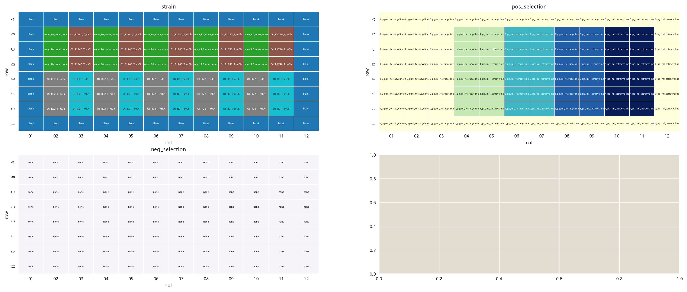

# 2020-11-20 Plate Reader Growth Measurement

## Purpose
Measure growth rates at low tetracycline concentrations to start working with model.
## Strain Information

| Plasmid | Genotype | Host Strain | Shorthand |
| :------ | :------- | ----------: | --------: |
| `none`| `none` |  HG105 |`HG105` |
| `pZS4*5-mCherry`| `galK<>25O1+11-tetA-C51m` |  HG105-1l |`O1 R1740 |
| `pZS4*5-mCherry`| `galK<>25O1+11-tetA-C51m` |  HG104 |`O1 R22|
| `pZS4*5-mCherry`| `galK<>25O1+11-tetA-C51m` |  HG105 |`O1 R0 |

## Plate Layout

**96 plate layout**

## Notes & Observations

## Analysis Files

**Whole Plate Growth Curves**

**Whole Plate Growth Rate Inferences**

## Experimental Protocol

1. Cells as described in "Strain Information" were grown to saturation in 5 mL
   of LB + Kan overnight.

2. The next morning cells were diluted 1:1,000 into 4 mL of M9 + 0.5% glucose.

3. 10 µL of saturated M9 cultures were added to 300 µL of media according to the
   plate layout.

4. The plate was placed in a Biotek Gen5 plate reader and grown at 37ºC, shaking
   in a linear mode at the fastest speed. Measurements were taken every 25
   minutes for approximately 24 hours.

## Conclusions

The conclusions presented here come from a qualitative assessment of the data 
done with the `growth_plate_reader_exploration.ipynb` file:
The growth rates are following the expected trend. The tetracycline resistant strain is much more susceptible to sucrose. Note that the wild type also has reduced growth with increasing sucrose. However, it still grows much better than the resistant strain. By combining tetracycline and sucrose we were able to inhibit growth of both resistant and wild type strain. 
